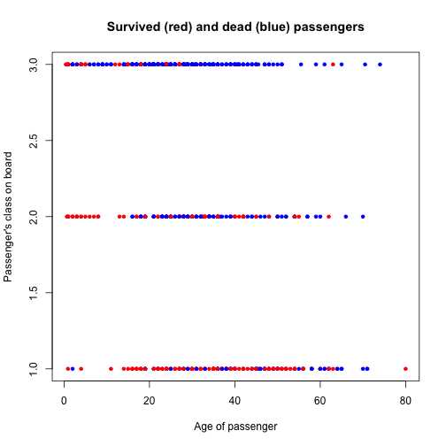

## Introduction

The Titanic was a British passenger liner that sank in the North Atlantic Ocean in the early morning of 15 April 1912 after colliding with an iceberg during her maiden voyage from Southampton, UK to New York City, US. I got a list of passengers' information from Kaggle competition community (https://www.kaggle.com/c/titanic). In data processing, I removed all the NAs in dataframe.

```
- data <- read.csv("passenger.csv",sep=",")
- data <- na.omit(data)
```


--- .class #id 

## Goal of analyse

The main goal is to analyse what sorts of passengers were likely to survive, which factors affect the survival probability. I have chosen 3 factors for users :

- Sex of passenger
- Age of passenger
- Passenger's class on board

Also, users can define the volume of his sample in analysis. 

--- .class #id 
## Plot tool

In the plot tool, I defined red points representing survived passengers and blue points representing dead passengers.
```
red <- Plot_Data$Survived

plot(Plot_Data$Age,Plot_Data$Pclass,pch=20,col=rgb(r=red,g=0,b=1-red))

```

--- .class #id 
## Conclusion


```
## Loading required package: rCharts
```


As we can see from the figure above, the passengers in the first-class and children have higher survival probabilities than others.


